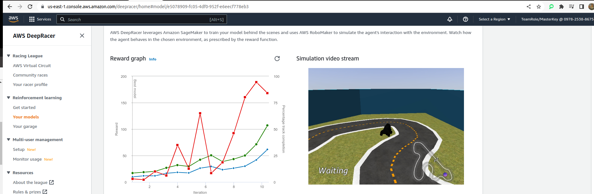

# AWS DeepRacer

At first I get 22 sec on evaluation track, then I changed its hyperparameter, reward function, RL algorithm and action space. After various iteration of model training and evaluatio I ended with 9 sec.  

Here is the link for AWS DeepRacer: https://aws.amazon.com/deepracer/  

This is my evaluation graph which shows all the training, evaluation and reward function uptrend with the increment on iteration which shows model is learning. 

